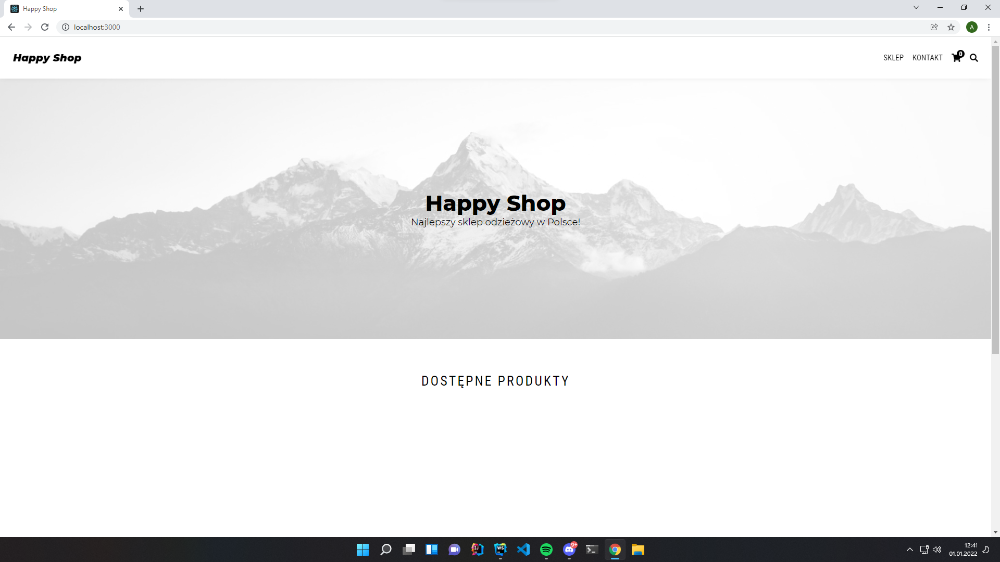
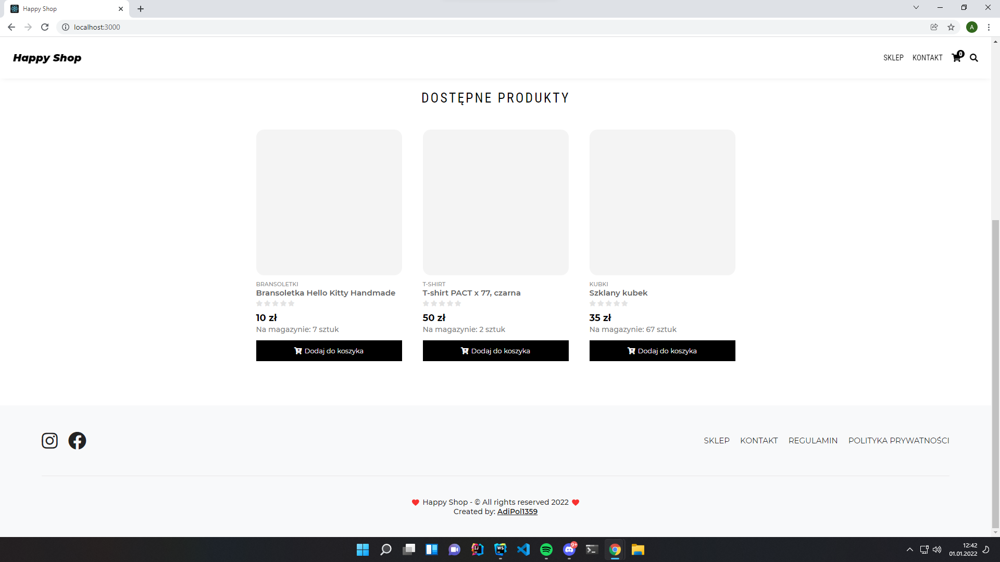
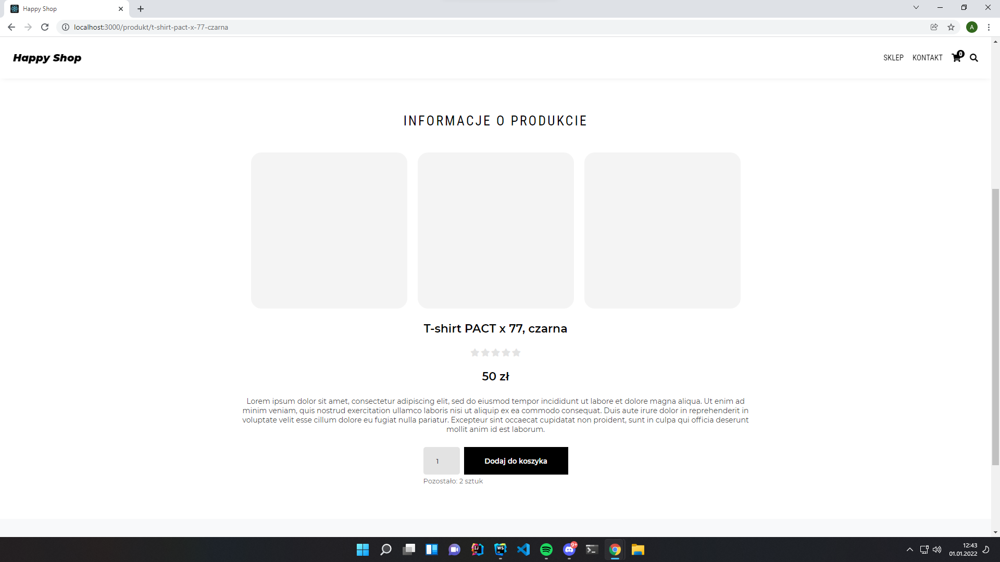
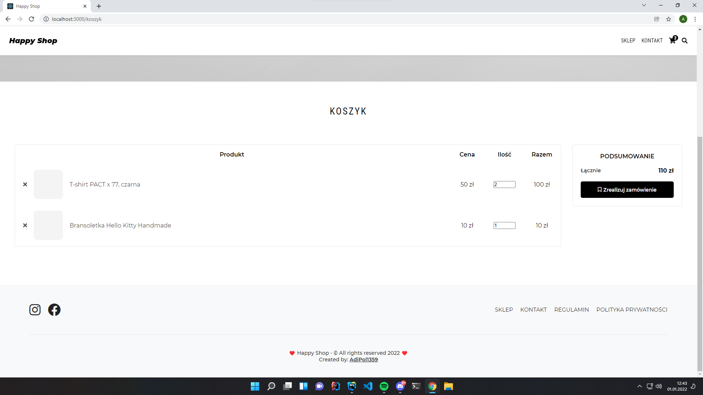

# Happy Shop

### Happy shop is a free, open source online store written in React.

## Features
- Responsiveness
- Ability to add your own items
- Shopping cart saves items to cookies files

## TODO
- Admin Panel
- Payments
- Code review
- Backend

## Demo
Demo you can find here: 
[https://sklep.projectcode.pl](https://sklep.projectcode.pl)

## Warning
This project is under development and it is not recommended to use it.

## Screenshots

## Contact
- IG: adipol_pcode
- Discord: AdiPol1359#8770